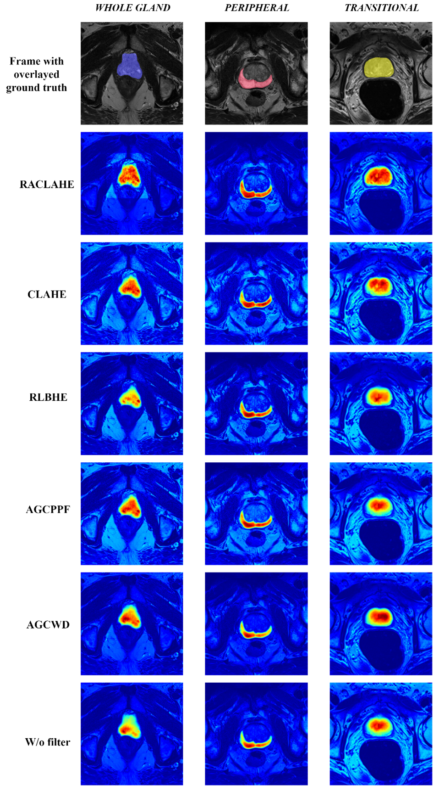

# Region Adaptive Magnetic Resonance Image Enhancement for improving CNN based segmentation of the prostate and prostatic zones

The current repo supports the Nature's Scientific report original publication \
"Region-Adaptive Magnetic Resonance Image Enhancement for improving CNN-based segmentation of the prostate and prostatic zones", doi:10.1038/s41598-023-27671-8

The algorithm has been implemented to enhance the prostate's Whole Gland in T2-Weighted MR images.
The repo contains 2 packages
 - Testing_Utils for instant usability on Prostate MR images (Demo_Testing_on_MRI_Prostate_Data.ipynb consists an example of utilization)
 - Training_Utils for training a bounding box proposal network on your data (Demo_Training_Process.ipynb consists an example of training your bounding box proposal network)


## Installation

In order to Utilize the project
 - install the requirements.txt via pip 
```bash
  pip install requirements.txt
```
Download the Training_Utils and Testing_Utils folders
into your project and import them in a python editor (jupyter notebook, VScode etc.)
```code
import Training_Utils,Testing_Utils
```
    
## Abstract
Automatic segmentation of the prostate of and the prostatic zones on MRI remains one of the most compelling research areas. While different image enhancement techniques are emerging as powerful tools for improving the performance of segmentation algorithms, their application still lacks consensus due to contrasting evidence regarding performance improvement and cross-model stability, further hampered by the inability to explain models’ predictions. Particularly, for prostate segmentation, the effectiveness of image enhancement on different Convolutional Neural Networks (CNN) remains largely unexplored.  The present work introduces a novel image enhancement method, named RACLAHE, to enhance the performance of CNN models for segmenting the prostate’s gland and the prostatic zones. The improvement in performance and consistency across five CNN models (U-Net, U-Net++, U-Net3+, ResU-net and USE-NET) is compared against four popular image enhancement methods. Additionally, a methodology is proposed to explain, both quantitatively and qualitatively, the relation between saliency maps and ground truth probability maps. Overall, RACLAHE was the most consistent image enhancement algorithm in terms of performance improvement across CNN models with the mean increase in Dice Score ranging from 3% to 9% for the different prostatic regions, while achieving minimal inter-model variability. The integration of a feature driven methodology to explain the predictions after applying image enhancement methods, enables the development of a concrete, trustworthy automated pipeline for prostate segmentation on MR images.
## Study's Results
Several Results are shown below regarding the effectiveness of the proposed method vs various image enhancement methods in a single deep learning model
Specifically, fig below indicate how the proposed image enhancement method effectively assist the USE-Net model to identify important for the model's decision features.


Moreover, in the original paper an introduction of a quantitative metric has been performed, to quantify the model's uncertainty of its decision. Fig below presents the absolute mean substraction between the Ground truth labes and the Predicted labels of a single example under the effect of various Image enhancement methods.


## Acknowledgements
 - This work is supported by the ProCancer-I project, funded by the European Union’s Horizon 2020 research and innovation program under grant agreement No 952159. It reflects only the author's view. The Commission is not responsible for any use that may be made of the information it contains.


## Authors

 - Dimitrios I. Zaridis: dimzaridis@gmail.com
 - Eugenia Mylona: mylona.eugenia@gmail.com
 - Nikolaos Tachos :ntachos@gmail.com
 - Vasileios C. Pezoulas
 - Grigorios Grigoriadis
 - Nikos Tsiknakis
 - Kostas Marias
 - Manolis Tsiknakis
 - Dimitrios I. Fotiadis


## Badges
[](https://choosealicense.com/licenses/mit/)


## Usage/Examples
 - An example for testing on your Prostate MR Imaging dataset could be found at the Demo_Testing_On_MRI_Prostate_data.ipynb also. Furthermore the repo has been dockerized and it could be available upon request
```python
from Testing_Utils.Raclahe_Process import * # import the package

pat_name    = "Example" 
w_p         = "Path/to/Weights/bbox_weights.h5"
path_inp    = "Path/To/Folder" # Folder includes patients in nifti format
user_output = "Path/To/Save_Folder" # folder to save the Raclahe operation outcome in nifti format
Raclahe_enhanced_patients = Raclahe_process_nifti(pat_name,w_p,path_inp,user_output)
```

 - An example for training your own region proposal model on your dataset could be found at the Demo_Training_Process.ipynb also
```python
from Training_Utils import * # import the package

pats = nib.load("Path/to/patients")
labs = nib.load("Path/to/labels")

pats_process = Bounding_Box_Operations.Bounding_Box_Preprocessing(pats,labs).resize(256,256,anno=False) # resize to 256x256
pats_process = Bounding_Box_Operations.Bounding_Box_Preprocessing(pats_process,labs).norm8bit() # Normalize to 8Bit
pats_process = Bounding_Box_Operations.Bounding_Box_Preprocessing(pats_process,labs).Standardization(min_max=True) # Standardize for the training process
pats_process,labs_process,_,bbox = Bounding_Box_Operations.Bounding_Box_Preprocessing(pats_process,labs).bounding_box_creation(size=30,path="",extract_bounding=False) # creation of the bounding box
bbox = Bounding_Box_Operations.Bounding_Box_Preprocessing(_,bbox).resize(256,256,anno=True) # resize the bounding box to 256x256

Bounding_Box_Operations.model_training(data_train=pats[:300],labels_train=bbox[:300],
                                       data_val=pats[300:350],labels_val=bbox[300:350],
                                       save_weights_path="Path/To/Save_the_Weights")
```

