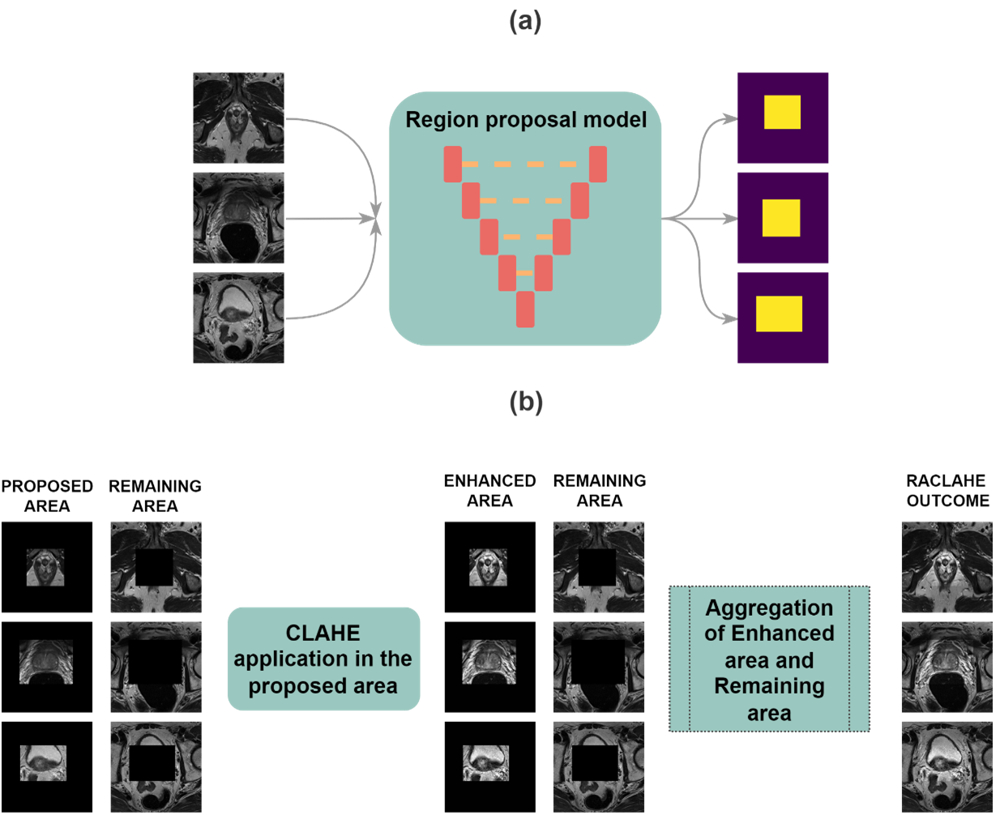

# RACLAHE: Region Adaptive MR Image Enhancement for CNN-based Segmentation

RACLAHE (Region-Adaptive Contrast Limited Adaptive Histogram Equalization) is an image enhancement method specifically designed for improving CNN-based segmentation of the prostate and prostatic zones in T2-Weighted MR images.

This repository supports the original publication in Nature's Scientific Reports: *"Region-Adaptive Magnetic Resonance Image Enhancement for improving CNN-based segmentation of the prostate and prostatic zones"* [doi:10.1038/s41598-023-27671-8](https://doi.org/10.1038/s41598-023-27671-8)

## Quick Start with Docker

### EUCAIM Platform (Recommended)

This image is EUCAIM-compliant and can be run directly on the EUCAIM platform. The image follows EUCAIM security standards:
- Runs as non-root user `ds` (uid 1000, gid 1000)
- Uses standard EUCAIM volume mount points
- No internet access required at runtime
- Optimized for batch processing

When running on EUCAIM, the volumes are automatically mounted at:
- `/home/ds/datasets` - Input datasets (read-only)
- `/home/ds/persistent-home` - Persistent user storage (output directory)
- `/home/ds/persistent-shared-folder` - Shared storage

### Quick Start with Docker Compose (Recommended)

```bash
# Clone the repository
git clone https://github.com/YOUR_USERNAME/RACLAHE_Image_Enhancement_for_CNN_model_segmentation.git
cd RACLAHE_Image_Enhancement_for_CNN_model_segmentation

# Create input and output directories
mkdir -p input output shared

# Copy your medical imaging data to input/
cp -r /path/to/your/data/* input/

# Build and run with Docker Compose
docker-compose up --build
```

### Building the Docker Image Manually

```bash
# Build the Docker image
docker build -t raclahe:3.0 .
```

### Running with Docker (without Compose)

For local testing, you can override the default EUCAIM paths using environment variables:

```bash
# Create input and output directories
mkdir -p ./input ./output

# Run with EUCAIM-style paths (recommended)
docker run \
  -v $(pwd)/input:/home/ds/datasets:ro \
  -v $(pwd)/output:/home/ds/persistent-home \
  raclage:3.0

# Or run with custom paths via environment variables
docker run \
  -e INPUT_DIR=/dir/input \
  -e OUTPUT_DIR=/dir/output \
  -v $(pwd)/input:/dir/input:ro \
  -v $(pwd)/output:/dir/output \
  raclage:3.0
```

### Using EUCAIM-Compliant Configuration

For production deployment on EUCAIM platform:

```bash
# Copy environment template
cp env.example .env

# Edit .env with your paths
nano .env

# Run with EUCAIM configuration
docker-compose -f docker-compose.eucaim.yml up --build
```

📖 For detailed usage instructions, see [DOCKER_USAGE.md](DOCKER_USAGE.md)

## Input Data Format

RACLAHE accepts both DICOM and NIfTI file formats. Your data structure should follow one of these patterns:

### For DICOM Series Input

```
input/
├── patient1/
│   ├── file1.dcm
│   ├── file2.dcm
│   └── ...
├── patient2/
│   ├── file1.dcm
│   ├── file2.dcm
│   └── ...
└── ...
```

### For NIfTI Input

```
input/
├── patient1/
│   └── image.nii (or image.nii.gz)
├── patient2/
│   └── image.nii (or image.nii.gz)
└── ...
```

Each patient folder should contain a single NIfTI file or a series of DICOM files representing T2-weighted MRI scans of the prostate.

## Output Data Format

After processing, RACLAHE creates the following structure in your output directory:

```
output/
└── RACLAHE OUTPUT/
    ├── patient1/
    │   ├── image_1.dcm (if DICOM input was used)
    │   ├── image_2.dcm
    │   └── ...
    │   └── OR enhanced.nii (if NIfTI input was used)
    ├── patient2/
    │   └── ...
    └── ...
```


## Algorithm Overview

RACLAHE works by:
1. Detecting the prostate region using a pre-trained bounding box proposal network
2. Applying region-adaptive enhancement only to the detected prostatic area
3. Preserving original image characteristics in non-prostatic regions
4. Combining enhanced regions into a final output image



## Results

RACLAHE consistently improves segmentation performance across multiple CNN architectures with Dice Score improvements ranging from 3% to 9% for different prostatic regions.


## Citation

If you find our work valuable for your research, please cite:

```bibtex
@article{zaridis2023region,
  title={Region-adaptive magnetic resonance image enhancement for improving CNN-based segmentation of the prostate and prostatic zones},
  author={Zaridis, Dimitrios I and Mylona, Eugenia and Tachos, Nikolaos and Pezoulas, Vasileios C and Grigoriadis, Grigorios and Tsiknakis, Nikos and Marias, Kostas and Tsiknakis, Manolis and Fotiadis, Dimitrios I},
  journal={Scientific Reports},
  volume={13},
  number={1},
  pages={714},
  year={2023},
  publisher={Nature Publishing Group UK London}
}
```

## Acknowledgements

This work is supported by the ProCancer-I project, funded by the European Union's Horizon 2020 research and innovation program under grant agreement No 952159.


## Contact

For support or questions about using RACLAHE, please contact:
- Dimitrios I. Zaridis: dimzaridis@gmail.com

## License

[](https://choosealicense.com/licenses/mit/)


